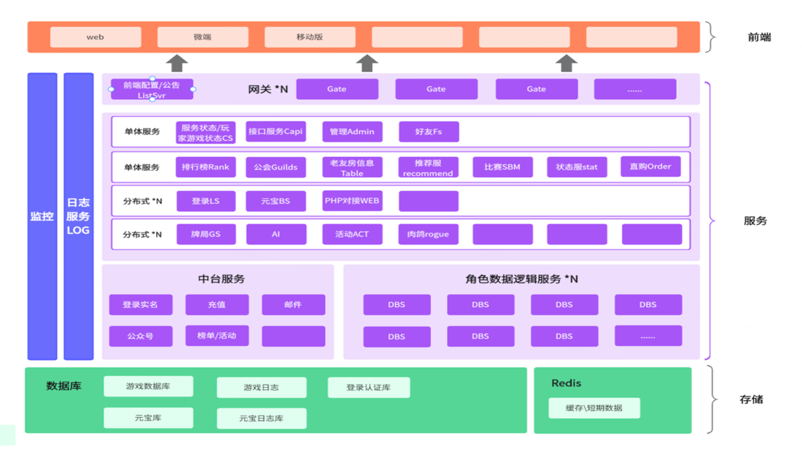
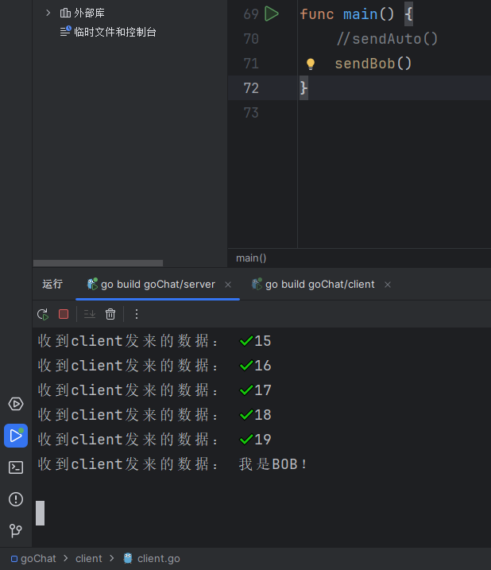

<!-- TOC -->

- [1. 游戏流程实现](#1-游戏流程实现)
    - [准备游戏-创建房间](#准备游戏-创建房间)
    - [匹配开始-排位桌子](#匹配开始-排位桌子)
    - [开始游戏-回合阶段](#开始游戏-回合阶段)
    - [结束游戏-死亡出局](#结束游戏-死亡出局)
    - [游戏中途-技能检测](#游戏中途-技能检测)
- [2. 服务器框架实现](#2-服务器框架实现)
    - [框架](#框架)
    - [基类包](#基类包)
    - [服务连接](#服务连接)
        - [建立与其他服务器的连接](#建立与其他服务器的连接)
        - [连接到中心服务器](#连接到中心服务器)
        - [注册消息处理函数](#注册消息处理函数)
    - [存储脏数据](#存储脏数据)
        - [入队](#入队)
        - [离线](#离线)
        - [队列与脏数据](#队列与脏数据)
        - [通知CS](#通知cs)
- [3. go聊天服务器实现-TCP](#3-go聊天服务器实现-tcp)
    - [client](#client)
    - [server](#server)
- [4. 游戏开发一致性实现](#4-游戏开发一致性实现)
    - [概念](#概念)
        - [CAP](#cap)
        - [BASE](#base)
    - [如何实现一致性？](#如何实现一致性)
        - [分布式锁](#分布式锁)
        - [分布式事务](#分布式事务)
    - [ol服务器代码-实现一致性示例](#ol服务器代码-实现一致性示例)
        - [统一递交](#统一递交)
        - [日志回溯](#日志回溯)
        - [冲突避免](#冲突避免)

<!-- /TOC -->

<div STYLE="page-break-after: always;"></div>

# 1. 游戏流程实现

## 准备游戏-创建房间
1. 接收cs消息
```cpp
gs_msg_centersever.cpp
void CGsNetMg::hand_msg_centerserver(unsigned int conid,const void *pdata,unsigned int data_len)
case CS_GS_USERCREATETABLE_REQ: //cs请求gs创建桌子
```

2. 创建房间-前置
```cpp
gs_msg_centersever.cpp
CGameTable *ptbl  = dynamic_cast<CGameTable*>(gsTableMg::single()->create_table( pMsg,result ));//创建桌子
```
- 创建`MsgGsCsUserCreateTableRep`类型的变量，存储创建桌子的结果。
- 创建`CHelpAutoSendMsg`自动发送消息的对象，用于向CS发送创建桌子的请求。
- 创建`CAutoCallFun`类型的变量，用于在创建桌子失败时调用对应函数。
- 如果`ptbl`不为空，则将用户设置为桌子的玩家，并返回创建桌子的结果。
- 如果`ptbl`为空，则创建桌子，并返回创建桌子的结果。

3. 创建房间-页面
```cpp
gsTableMg.cpp 
gsTable *ptbl = get_empty_table( pMsg,result,pDataMatch );
```
根据`pMsg`中的信息创建一个新的`gsTable`对象，将其添加到游戏服务器中的桌面对象列表中。检查`pMsg`中的页面ID数组，并将相应的页面添加到房间的关联页面列表中。检查是否为双内奸模式。

4. 创建房间-初始化房间数据
```cpp
gsTableMg.cpp 
if (!pTable->create_init(pUser,pMsg,result))
```
根据`pMsg`结构体中的信息创建一个新的游戏桌，并初始化其匹配数据。

5. 创建房间-初始化房间
```cpp
gameTable.cpp 
TModelSectionItem *pMSItem = CTblConfigMg::single()->find( this );
```
创建游戏房间的具体初始化。设置游戏房间的名称、最小和最大等级，循环分配座位。

## 匹配开始-排位桌子
```cpp
cs_createtable_forttrank.cpp 
bool CTTRankBase::create_table_new(ParamStartTTRankGame &param)
if (!pUser->sendmsg_gameserver(&msgReq, msgReq.Len))
```
CS发给GS请求CsGgTTRankCreatetableReq，创建排位桌子

```cpp
gs_msg_centersever.cpp 
hander_delayfun impdelayfun = boost::bind(&CGameTable::ttrank_auto_begingame, ptbl, pmsg->ttrank_group_id, pmsg->racercount + pmsg->ai_count, pCopyMsg);
CGsNetMg::single().PushDelayTimeFun(timelen_begin,boost::bind( CGameTable::delay_call_gstable_fun,ptbl->get_table_id(),impdelayfun) );
```
GS发给CS排位桌子消息，延迟获取桌子并自动开始游戏（无人中途离开情况下）

---

1. 初始
```cpp
CS.cpp 
```
CS，从main函数到PeonyMain.h ，CServer.cpp 

2. 服务主函数
```cpp
CServer.cpp 
void CSServerApp::Run()
```
维持运行，记录时间。

3. 天梯表操作
```cpp
ttrank_mg.cpp
void CTTRankMg::run()
//天梯循环
for (unsigned int type=TTRank_type_begin; type<TTRank_type_end; type++)
{
    CTTRankBase *pttrank = get_ttrank(type);
    if(pttrank)
        pttrank->Run();
}
```
- 根据两次时间差，新建/更新天梯表，然后循环处理
- 处理逃跑

4. 时间控制
```cpp
ttrank_happy_new.cpp 
void CTTRankHappyNew::Run()
if (!pAssign->fun_create_table)
{
	pAssign->fun_create_table = boost::bind(&CTTRankHappyNew::create_table, this, _1, _2, _3);
}
```
- 每秒匹配一次
- 检查桌子创建状态并创建桌子（发给GS请求）

5. 快速匹配玩家和队伍
```cpp
CTTRankAssignType6.cpp
void CTTRankAssignType6::QuickMatch(unsigned int cnt, unsigned int 
userMatcher.Insert(_makeAT6SKMScore(pTarget->matchArg_TTLev, 0, pTarget->matchArg_Power), (int64_t)*it);gamemodel)
```
- 以不同时间150-3600，日志记录各队的玩家数量、缓冲队列、严格队列、timeout队列以及数据map的大小。
- `userMatcher`和`teamMatcher`，用于存储玩家和队伍的匹配。
- for循环获取对应类型的数据，过滤掉单刷电脑的，按照他们的matchArg_TTLev和matchArg_Power进行排序，并将其分别插入到`userMatcher`和`teamMatcher`。
- 检查队列中的数据是否超时。`mp_timeout`，`mp_Teams`，`mp_Singles`分别处理超时队列，队伍匹配，玩家匹配。

6. 匹配成功并弹出
```cpp
ttrank_assign_type6.cpp 
int	CTTRankAssignType6::mp_Singles(SkmC2& teamMatcher, SkmC2& userMatcher, const CTTRankNewBaseConfig* pRankCfg, const CTTRankNewConfig* pCycCfg, int _limit, bool idle)
```
处理单人模式下的匹配逻辑，包括查找队友、敌人以及队伍等。遍历`waitLists`中的用户，逻辑检查用户状态，分配`ret_list`中的`id`，对用户进行如下处理：

        case 404://找不到数据
        case 304://无法匹配
        case 1://错误异常
        case 2://创建group失败
        case 3://创建table失败
        default:pop(kv.K);//成功

## 开始游戏-回合阶段
1. 初始
```cpp
GameServer.cpp
SGS_TRY_SIGNAL;
```
- GS，从main函数到PeonyMain.h，GameServer.cpp

2.进入游戏过程ProcessTime()
```cpp
CGame.cpp 
ProcessTime();
```
- 检查异常状况，然后根据当前模式进入对应的ProcessTime()游戏过程
军八：CGame8.cpp
排位：CGameHappy.cpp 

3. 过程匹配
```cpp
CGame8.cpp
switch(GetProcessStep())
{
    case RolePhase:
    {
        if(!ProcessPhase())
            SetProcessStep(FindActionRole);
```
- 处于静默时间则返回
- switch(GetProcessStep())根据当前进程进入对应逻辑，例如展示主公身份，选择武将，进入阶段（共用rolePhase.cpp），进入下回合，结束游戏
军八：case RolePhase:
排位：case step_game_core:

4. 检测行为，进入回合
```cpp
CGame.cpp
bool CGame::ProcessPhase()
{
	if (!m_game_first_turn_start)
	{
		m_game_first_turn_start = true;
	}

	if(m_actionMgr.ProcessAction(this))
		return true;

	return m_phaseMgr.ProcessPhase();
}
```

5. 阶段匹配m_curPhase
```cpp
rolePhase.cpp
switch(m_curPhase)
{
    case PHASE_JUDGE://判定阶段
        processJudge();
```
- 检查角色死亡且当前阶段是否在`PHASE_CLEARUP`和`PHASE_INIT`之间，如果是则尝试将当前阶段更改为清理阶段`PHASE_CLEARUP`
- 检查当前阶段迭代器是否已经到达阶段列表的末尾。
- 进入对应阶段，返回F。
- 如果当前阶段为尾阶段`PHASE_TURN_OVER`，返回T，可以设置步骤3的FindActionRole，找到下一个存活角色。

6. 进入阶段内某一节点m_step
```cpp
rolePhase.cpp
void CPhaseMgr::processJudge()
```
- 触发此节点的时机，如族吴苋【贵相】
- 设置当前m_step进入下一节点，若进入尾节点Step_nextPhase，调用NextPhaseAndNtfClient()处理后事，m_curPhase后移

7. 游戏结束
```cpp
CGame8.cpp
GameOver();
```
摸牌/时间平局，角色死亡后触发胜利条件，逃跑投降，出现任一情况时，置为游戏结束，处理游戏结束时的各种清理和统计工作。
军八：case Over:
排位：case step_game_over:

## 结束游戏-死亡出局
1. 初始

2. 进入游戏过程ProcessTime()

3. 过程匹配
```cpp
CGameHappy.cpp
switch (GetProcessStep())
{
    case step_game_core:
        {
            if(!onStepGameCore())
            {
                APPLOG_ERROR_GAME_LOGIC("error game over, step="<<GetProcessStep()<<FUN_FILE_LINE);
                SetProcessOver();
            }
```

4. 进入行为与回合
```cpp
CGameHappy.cpp
bool CGameHappy::onStepGameCore()
{
	if(ProcessPhase())
		return true;

```

5. 检测行为，进入回合
```cpp
CGame.cpp
bool CGame::ProcessPhase()
{
	if (!m_game_first_turn_start)
	{
		m_game_first_turn_start = true;
	}

	if(m_actionMgr.ProcessAction(this))
		return true;

	return m_phaseMgr.ProcessPhase();
}
```

6. 处理动作逻辑

```cpp
actionMgr.cpp
pAc->Resolve();
```
- 从动作队列中获取一个最新的动作（`pAc`），并检查该动作是否已经结束。
- 如果没有结束，则调用`Resolve`函数处理该动作。
- 在处理完一个动作后，将其从队列中弹出，并调用`OverAction`和`DestroyAction`函数清理该动作。
- 如果动作队列已经为空，则执行以下操作：
    - 将牌堆中的牌移动到弃牌堆中。
    - 调用`OnAllActionOver`函数处理所有动作结束后的逻辑。
    - 调用`AchievementAllResolve`函数处理成就相关逻辑。
    - 调用`DealWithGiveUp`函数处理放弃相关逻辑。

7. 死亡流程匹配

```cpp
dying_action.cpp 
void CDyingAction::Resolve()
{
    switch (GetResolveStep())
    {
        case step_after_dead_game:
        case step_check_gameisover:
```
判断濒死到死亡前中后的状态，进入对应逻辑，直到游戏结束切换页面

8. 死亡逻辑处理
```cpp
CGameHappy.cpp
for (PRoleVct::const_iterator iter = roleList.begin(); iter != roleList.end(); ++iter)
	{
		CRole* pTemp = *iter;
		if (NULL == pTemp || !pTemp->IsAlive() || pTemp->GetFigure() != pDeadRole->GetFigure())
			continue;
```
找到死者的队友，摸1牌

## 游戏中途-技能检测
1. 略……处理动作逻辑
```cpp
actionMgr.cpp
pAc->Resolve();
```
若检测完成，则下一步-2触发技能效果

2. 检查触发器是否需要等待

```cpp
trigger_action.cpp 
void CTriggerAction::Resolve()
case step_trigger:
{
    onStepTriggerSpell();
}
```
3. 处理技能相关，如技能重置和技能动画
```cpp
trigger_action.cpp 
void CTriggerAction::onStepTriggerSpell()
{
	//special enquire all
	if(Opp_ask_wuxie == get_opp())
	{
		if (trigger_spell())
			return;
		SetOverMark();
		return;
	}
```

4. 选出能触发的技能
```cpp
trigger_action.cpp 
bool CTriggerAction::trigger_spell(const Vec_triggerSpell& rSpellVct)
unsigned int uCurTriggerCount = CSpellMgr::single()->CanTrigger( uSpellId, GetGame(), param);
```
遍历传入的`rSpellVct`向量，对每个技能进行检查。如果技能不存在，或者触发条件不满足，则跳过该技能，触发条件满足则：
1. 检查角色是否有该技能。如果角色没有该技能，或者技能是判定牌特殊处理，则跳过该技能。
2. 检查触发器记录（`TriggeredRecord`）是否存在。如果存在，且已经触发过，则跳过该技能。
3. 重新调用事件触发接口`CanTriggerMeParam`，检查当前技能是否可以触发。如果不能触发，则跳过该技能。
4. 设置触发器记录（`set_spell_triggered`），并将其添加到`m_waitTriggerRecordVec`向量中。
5. 处理触发器记录的标志位，如锁定技、群体询问等。
6. 如果`m_waitTriggerRecordVec`向量不为空，则执行`processTriggerSpell`函数，处理触发器技能。

5. 判断技能是否能触发
```cpp
spellMgr.cpp 
unsigned int CSpellMgr::CanTrigger( unsigned spellId, CGame *pGame, CanTriggerMeParam& triggerParam )
ISpell_CanTriggerMe pfun = iter->second;
if(pfun(pGame, &triggerParam))
    return triggerParam.outTriggerCount;
```
- 通过`iter->second`，获取到对应技能的CanTriggerMe函数，然后进入判断

# 2. 服务器框架实现
## 框架


## 基类包
PacketBase用于存储数据包的基本信息，如操作类型、长度，id。在子类中取值为：
- 操作类型：`protocol.h` `enum OPCode`中枚举所有协议
- 长度：`sizeof`当前`struct`
```cpp
gate_msg_client.cpp
bool CGatewayNetMg::hand_msg_client(unsigned int uConID,const void *pData,unsigned int data_len)

if (!m_AgEncrypt.decrypt((BYTE *)pData + sizeof(PacketBaseV2), (BYTE *)decrypt_buffer + sizeof(PacketBaseV2), data_len - sizeof(PacketBaseV2)))
```
以gate_msg_client为例解包：
1. 如果需要加密，首先获取数据包的头部信息（`PacketBase`结构体），然后根据数据包的类型（`PacketBaseV2`结构体）进行解密。解密失败时，关闭客户端连接并返回true。
2. 检查客户端发送的消息是否符合规定的长度
3. 检查客户端发送的消息是否符合常规协议
    1. 如果消息类型是CLIENT_LOGIN_REQ（客户端登录请求），它会检查消息的长度是否为490或458。
    1. 如果是，它会检查客户端版本是否为3300或3290。
    1. 如果是，它会设置一个标志位lowVerPass为true，表示这个消息是兼容的。
    1. 如果消息类型不是CLIENT_LOGIN_REQ，它会检查是否应该忽略这个消息。

## 服务连接

NetServerMg.h
- 主动连接的服务器连接成功后，首先需要报告自己的身份。
- 被动连接的服务器，收到身份报告后需要的处理是：
  - 如果自己是CS：需要通知服务器自己的连接管理，需要设置网络事件的接口函数。
  - 如果自己不是CS：需要设置网络事件的接口函数。

### 建立与其他服务器的连接
```cpp
ServerConnectMg.h
bool BuildConToOtherServer(const Msg_CS_Notice_NewServerStartUp::ItemServer *pItemServer);
```
解析 `pItemServer` 指向的结构体，获取服务器的IP地址和端口号等信息。

### 连接到中心服务器
```cpp
ServerConnectMg.cpp
bool CGatewayNetMg::ConnectToCS()
{
    return this->BuildConnectToCS(					
        boost::bind(&CGatewayNetMg::hand_connect_cs, this, _1, _2, _3),
        boost::bind(&CGatewayNetMg::hand_msg_centerserver, this, _1, _2, _3),
        boost::bind(&CGatewayNetMg::hand_disconnect_cs, this, _1, _2)
    );
}
```
尝试连接到中心服务器（CS）。函数内部使用了boost库中的 `bind` 函数，将三个回调函数绑定到 `ConnectToCS` 函数的参数上，用于处理与中心服务器的连接。

### 注册消息处理函数
```cpp
gate_msg_handles.cpp
void XXX_init_handles()
enum ProtocolBuffersCodeId
```
注册消息处理函数，并从 `ProtocolBuffersCodeId` 中指定消息类型服务器ID（`svrID`）、服务器类型（`svrType`）、连接ID（`connid`）、消息头（`pMsgHeader`）和消息体（`msgin`）

## 存储脏数据
`第一周遗留问题：脏数据的处理流程是怎样的？`

当用户数据发生变更时，若该数据无需长期保留，则会直接存储于Redis缓存数据库。对于需要长期保存的数据，我们不会立即进行存储，而是将其标记为“脏数据”并加入到用户数据保存队列中。该队列分为高优先级和低优先级两个子队列，数据将根据其标记自动进入相应的队列。

用户数据保存管理器将定期从队列中提取用户对象，并根据其脏标记将相应的数据持久化到MySQL数据库。高优先级队列的轮询频率更高，确保数据保存更为及时。

### 入队
```cpp
UserSaveDataMg.h
void CUserSaveDataMg::push_save_userdata_queue( CUser *puser,bool isPrior )
if( isPrior && !puser->IsUserMark(em_dbs_mark_save_list_prior))
```
1. 两个参数：一个CUser类型的指针puser和一个布尔值isPrior
2. isPrior为true，不在优先队列，则入优先队列
3. 两队列都不在，则入普通队列

### 离线
```cpp
UserSaveDataMg.cpp
void CUserSaveDataMg::push_useroffline( CUser *pUser )
```
1. 将pUser的当前状态设置为离线CUser::UserOffline，添加到m_offline_user向量中。
2. 调用CMonitor3::single()->SyncInc(MUserDirty3, 1)，用于同步更新用户脏数据。

### 队列与脏数据
```cpp
UserSaveDataMg.cpp
void CUserSaveDataMg::run_lowpriority()
void CUserSaveDataMg::run_prior()
```
1. 条件检测。数据库连接数是否小于50

2. 查缓存。从`CUserMg::Single()->Find(dataseal.user_temp_id)`中查找用户`pUser`，如果找不到，则从`CUserCacheMg::Instance()->GetUserCache(dataseal.account)`中查找用户缓存。如果找到用户缓存，则将用户`pUser`设置为该缓存的指针，并将时间延迟设置为15秒。

3. 只留长时间。判断当前时间是否在work时间范围内。如果在work时间范围内，计算用户数据保存的时间长度（`uTimelen`），如果小于`timeDelay`，则直接返回。（仅run_lowpriority()包含此步骤）

4. 判断脏数据。如果用户`pUser`存在且其`IsDirtyXX()`方法返回`true`，则根据不同的`XX`类型，分别保存用户的数据、活动、 Roguelike、排行榜信息和邀请数据。

5. 出队。在保存用户数据后，将用户`pUser`的`ClearUserMark(em_dbs_mark_save_list_low)`方法设置为`true`，并将该数据块从`m_savequeue_lowpriority`队列中移除。

### 通知CS
```cpp
UserSaveDataMg.cpp
void CUserSaveDataMg::run_notice_cs_theseuser_finishoffline()
  if( msgRpt.ref_count>=MsgDbsToCsUsersOfflineRpt::sc_max_usercount )
  {
    global_app_sendmsg_to_CS(&msgRpt,msgRpt.Len);
    msgRpt.ref_count = 0;
  }
```
通知CS服务器哪些用户已经下线并保存了数据。首先检查`m_finish_offline_userlist`队列中是否有超过20个用户，如果有，则将队列中的用户数据发送给CS服务器。然后清空`m_finish_offline_userlist`队列。

# 3. go聊天服务器实现-TCP

## client
`client.go`
- 命令行输入发送消息
```go
func sendBob()
```
1. 创建一个TCP连接，延迟关闭
1. 无限循环持续读取用户输入的文本消息
1. `proto`编码消息，将编码后的消息写入连接

## server
`server.go`
- 主函数

1. 创建一个TCP服务器监听指定IP端口，延迟关闭
1. 等待一个一个一个客户端连接，开启新协程
- 处理client发送的消息
```go
func process(conn net.Conn)
```
1. 缓冲区读取器
1. `proto`解码消息，若读取到文件末尾io.EOF返回
---
`proto.go`
- 编码
```go
func Encode(message string) ([]byte, error)
```
1. 读取消息的长度，转换成int32类型（占4个字节）
1. 写入消息头和消息实体

- 解码
```go
func Decode(reader *bufio.Reader) (string, error)
```
1. 读取消息的长度-前4个字节的数据
1. 读取消息的数据

# 4. 游戏开发一致性实现
## 概念
### CAP
- 一致性（Consistency） ：等同于所有节点访问同一份最新的数据副本，或者说同一数据在不同节点上的副本在同一逻辑时钟应当是相同的内容。
- 可用性（Availability）：每次请求都能获取到非错的响应，以及尽量保证低延迟，但是不保证获取的数据为最新数据。
- 分区容错性（Partition tolerance）：以实际效果而言，分区相当于对通信的时限要求。要求任意节点故障时，系统仍然可以对外服务。

如果系统发生“分区”，我们要考虑选择 CP【ZooKeeper】 还是 AP【Eureka】。如果系统没有发生“分区”的话，我们要思考如何保证 CA 。
### BASE
BASE 是 Basically Available（基本可用）、Soft-state（软状态） 和 Eventually Consistent（最终一致性） 三个短语的缩写，是 CAP 理论中 AP 方案的延伸

- 最终一致性
最终一致性强调的是系统中所有的数据副本，在经过一段时间的同步后，最终能够达到一个一致的状态。因此，最终一致性的本质是需要系统保证最终数据能够达到一致，而不需要实时保证系统数据的强一致性。

- 实现最终一致性的具体方式
    - 读时修复 : 在读取数据时，检测数据的不一致，进行修复。比如 Cassandra 的 Read Repair 实现，具体来说，在向 Cassandra 系统查询数据的时候，如果检测到不同节点的副本数据不一致，系统就自动修复数据。
    - 写时修复 : 在写入数据，检测数据的不一致时，进行修复。比如 Cassandra 的 Hinted Handoff 实现。具体来说，Cassandra 集群的节点之间远程写数据的时候，如果写失败 就将数据缓存下来，然后定时重传，修复数据的不一致性。
    - 异步修复 : 这个是最常用的方式，通过定时对账检测副本数据的一致性，并修复。

## 如何实现一致性？

1. **分布式事务**：
   - 使用 **两阶段提交（2PC）** 或 **三阶段提交（3PC）** 协议来保证跨多个节点的事务一致性。
   - 采用 **补偿事务** 来处理失败的事务，确保系统最终达到一致状态。

1. **锁机制**：
   - 使用 **乐观锁** 和 **悲观锁** 来控制对共享资源的访问，防止数据冲突。
   - 实现 **分布式锁**（如 Zookeeper、Redis 等）来协调多个服务实例间的访问。

1. **版本控制**：
   - 通过维护数据的版本号，确保在更新数据时能够检测到并发修改，从而避免数据不一致。

1. **数据复制**：
   - 使用 **主从复制** 或 **多主复制** 来保持不同节点间的数据一致性。
   - 采用 **日志复制** 或 **事件源** 来确保数据在不同节点间的一致性。

1. **一致性哈希**：
   - 在分布式系统中使用一致性哈希算法来均匀分配负载，确保数据在节点间的均匀分布和快速路由。

1. **冲突解决策略**：
   - 在最终一致性模型下，设计冲突解决策略，例如 **最后写入胜出**、**合并策略** 等，以处理并发写入导致的数据冲突。

1. **监控与审计**：
   - 实现监控系统，及时发现和处理一致性问题。
   - 记录操作日志，便于回溯和审计，确保数据的可追溯性。

### 分布式锁
1. Redis的RedLock锁
如果对性能要求比较高的话，建议使用 Redis 实现分布式锁。推荐优先选择 Redisson 提供的现成分布式锁，而不是自己实现。实际项目中不建议使用 Redlock 算法，成本和收益不成正比，可以考虑基于 Redis 主从复制+哨兵模式实现分布式锁。

1. 基于ZooKeeper的分布式锁
如果对可靠性要求比较高，建议使用 ZooKeeper 实现分布式锁，推荐基于 Curator 框架来实现。不过，现在很多项目都不会用到 ZooKeeper，如果单纯是因为分布式锁而引入 ZooKeeper 的话，那是不太可取的，不建议这样做，为了一个小小的功能增加了系统的复杂度。
### 分布式事务
1. 2PCI/XA方案
1. TCC强一致性方案
1. 可靠消息最终一致性方案
1. 最大努力通知方案

## ol服务器代码-实现一致性示例
### 统一递交
山河图体力重置,修改数据都要由actserver来做，保证数据一致性
```cpp
UserRogueLikeAct.cpp 
void CUserRogueLikeAct::check_clear_data(unsigned int time)

roguelike::RogueLikeWorkNtf ntf;
ntf.set_type(roguelike::kWorkDailyReset);
auto pAct = DBSNetMg::single().find_session_rand_loadfactor_server(eActRogueServer);
if (pAct)
{
    NetMsgHandleModule::SendNetMsg(pAct->GetConID(), SS_ROGUELIKE_WORK_NTF, ntf, m_pUser->get_temp_id(), 0);
}
```

### 日志回溯
- 检查数据库返回的数据是否与请求中的数据一致。如果不一致，设置msg.result表示创建角色请求的返回结果的错误原因。
- 记录操作日志，便于回溯和审计，确保数据的可追溯性。
```cpp
DbManager.cpp 
void CDbManager::Imp_CreateRole(CsqlstringRequest *pRequest,const ClientMsgCreateRoleReq *pCopyRoleReqMsg)

string nickname(pQtNewNK->tbl_nickname);
if (nickname != string(pCopyRoleReqMsg->Nickname) || nickname.size() >= sc_max_nickname_len)
{
	IsHaveError     = true;
	APPLOG_ERROR( "[创建昵称失败] db返回的昵称和请求消息包的数据不一致! account="<<pQtNewNK->req_create_account<<";tbl_nickname="<<pQtNewNK->tbl_nickname<<";Nickname="<<pCopyRoleReqMsg->Nickname);
	msg.result		= TResult_CreateRoleReq::ret_creatrole_dberror_nickname_matchingerror;
	return;
}
```

### 冲突避免
- 使用`CHelpAutoSendMsg`类创建一个自动发送消息的对象`autosendmsg`，将`conId`和`repMsg`作为参数传递
- 操作铜钱之前，比对pUser->get_tongqian() != pMsg->curtotaltongqian操作后再进行后续处理
```cpp
dbs_msg_gameserver.cpp 
void DBSNetMg::NetMsgSsDbsTongqianConsumeReq( unsigned int conId, const SsDbsTongqianConsumeReq* pMsg )

CHelpAutoSendMsg autosendmsg( conId,&repMsg );
APPLOG_SYSINFO("[操作铜钱] account="<<pUser->getaccount()<<";dbstongqina="<<pUser->get_tongqian()<<";type="<<pMsg->type<<";msgtongqian="<<pMsg->optongqiancount );
if( pUser->get_tongqian() != pMsg->curtotaltongqian )
{
	APPLOG_ERROR("[操作铜钱.铜钱不一致] account="<<pUser->getaccount()<<";dbstongqina="<<pUser->get_tongqian()<<";msgtongqian="<<pMsg->curtotaltongqian<<FUN_FILE_LINE );
}
```

---
