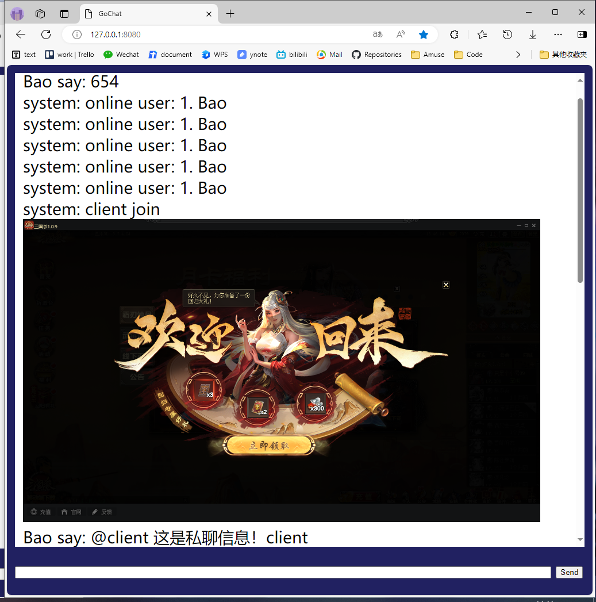

<!-- TOC -->

- [1. 开发任务](#1-开发任务)
    - [内容](#内容)
        - [苦肉](#苦肉)
        - [狼袭](#狼袭)
        - [破军](#破军)
        - [修罗](#修罗)
        - [神威](#神威)
        - [神躯](#神躯)
        - [神戟](#神戟)
    - [进度](#进度)
- [2. 项目实现](#2-项目实现)
    - [2-1. 配置](#2-1-配置)
        - [加载管理](#加载管理)
        - [使用实现](#使用实现)
    - [2-2. 中间件](#2-2-中间件)
        - [Redis](#redis)
        - [Kafka](#kafka)
            - [内容](#内容-1)
            - [实现](#实现)
        - [MySQL](#mysql)
- [3. 其他](#3-其他)
    - [Review](#review)
        - [可优化代码](#可优化代码)
        - [审查原则](#审查原则)
    - [gochat](#gochat)
- [上周问题](#上周问题)
    - [协议序列化](#协议序列化)
        - [原理](#原理)
        - [实现](#实现-1)
    - [ants](#ants)
        - [原理](#原理-1)
        - [实现](#实现-2)
        - [应用](#应用)
- [Q](#q)

<!-- /TOC -->

<div STYLE="page-break-after: always;"></div>

# 1. 开发任务
## 内容
### 苦肉
出牌阶段限3次，你可以（弃置0张牌）失去1点体力，然后回复1点体力

- H
技能流程：弃牌，体力变化，结束
- CONST
出牌阶段限制次数3
弃牌数0
回复体力数1
- REGISTER
REGISTER_NORMAL_SPELL
- CanTriggerMe
True
- CanCast
空检查：参数,角色存活
界限检查：濒死，使用次数，弃牌合法
- Resolve
1. 弃牌
    增加次数
    是否弃牌
2. 体力变化
    失去体力
    回复体力
3. 结束

- Data
- State
- TimeOutCallBack

### 狼袭
每个人的准备阶段，你可以对一名体力值不大于你的其他角色造成1~2点随机伤害。

- H

- CONST
伤害值下限1
伤害值上限2
- REGISTER
注册技能类型`REGISTER_TRIGGER_SPELL`
`trigger_action.cpp`注册时机Opp_phase_begin
- CanTriggerMe

- CanCast
//界限检查：选择角色数，选择角色体力
- Resolve
获取配置：伤害下限上限
随机伤害值

- Data
- State
- TimeOutCallBack

### 破军
当你使用【杀】指定目标后，你可以将其所有手牌移出游戏直到回合结束（X为其体力值）。你使用的【杀】对手牌区与装备区内牌数皆不大于你的角色造成的伤害+1。

- H
技能效果：盖牌，还原牌，加伤
盖牌流程：开始，移动卡牌，结束
- CONST
- REGISTER
    - 注册技能类型`REGISTER_TRIGGER_SPELL`
    - `trigger_action.cpp`注册时机
        Opp_after_choose_target
        Opp_after_turn_end
        Opp_When_Cause_Damage

    - `role.h`注册标记牌区域，`role.cpp`设置标记牌可见属性

- CanTriggerMe
匹配检查：杀的使用者
空检查：目标手牌数
匹配检查：技能效果时机
- CanCast
若为锁定技，TRUE
- Resolve
1. 盖牌
    请求：选牌（客户端直接全选）
2. 还原牌
    空检查：武将牌区
    消息：技能效果生效
3. 加伤
- State
CanRemove
- TimeOutCallBack
选择所有手牌

### 修罗
准备阶段，你可以弃置一张牌，然后弃置你判定区里所有牌。

- H
技能流程：
step_begin = 0, //选择要弃的牌
step_ask_discard_judge, //弃置判定区所有牌
step_end
- CONST
- REGISTER
    - 注册技能类型`REGISTER_TRIGGER_SPELL`
    - `trigger_action.cpp`注册时机Opp_phase_begin
- CanTriggerMe
空检查：判定区
- CanCast
界限检查：选中牌列表
- Resolve
1. step_begin
    弃选中牌区的唯一牌
2. step_ask_discard_judge
    选择判定区所有牌弃置
- Data
- State
- TimeOutCallBack

### 神威
锁定技，摸牌阶段，你多摸X张牌，你的手牌上限+X（X为敌方角色数）。

- H
- CONST

- REGISTER
    - 注册技能类型`REGISTER_TRIGGER_SPELL`
    - `trigger_action.cpp`注册时机Opp_add_deal_cnt
- CanTriggerMe
匹配检查：当前回合
获取敌人数
- CanCast
若为锁定技，TRUE
- Resolve
增加摸牌数
GetExHandCardLimit

### 神躯
每名角色的准备阶段，若你的手牌数不大于体力上限，你可以摸X张牌。（X为你的当前体力上限）当你受到伤害后，你可以使用一张【桃】。
- H
技能流程：
step_begin = 0,
step_wait_use_tao,
step_end
- CONST
出牌阶段限制次数3
- REGISTER
    - 注册技能类型`REGISTER_TRIGGER_SPELL`
    - `trigger_action.cpp`注册时机Opp_when_turn_begin，Opp_hurt_but_not_dead
- CanTriggerMe
界限检查：手牌数
是否可以使用桃
- CanCast
若为锁定技，TRUE
- Resolve
1. step_begin
匹配检查：动作
2. step_wait_use_tao
- NetMsg
1. 取消使用
2. 使用牌
消息：使用桃
3. 使用技能
- Data
- State
- TimeOutCallBack

### 神戟
你出牌阶段使用【杀】无次数限制，且可以多指定两个目标。
- H
- CONST
- REGISTER
    - `cardIdDefineEnumClass.h`注册技能ID
- CanTriggerMe
- CanCast
若为锁定技，TRUE
- Resolve
无次数限制
- NetMsg
- Data
- State
- TimeOutCallBack

## 进度
7个技能编写完成，进入前后端联调阶段，已与前端沟通，下周开始对接测试

**测试流程**
- 被动
与前端无交互，直接测试对应时机

- 附体
与前端有交互，放在原技能上测试，先暂时交换两个技能id，之后再改回去

- 临时
与前端有交互，后端临时手动命令，扮演处理交互的角色

# 2. 项目实现

## 2-1. 配置

### 加载管理
`conf_manager.go`
加载和重载配置文件，提供线程安全的访问和修改配置的方法。通过回调函数通知配置加载完成，并使用读写锁来保护配置的并发访问
- ConfManager
    - `app`: 指向ccframe框架的Application实例。
    - `Paths`: 配置文件路径。
    - `Develop`: 是否处于开发模式。
    - `loadCallback`: 配置加载完成后的回调函数。
    - `confLock`: 读写锁，用于保护配置的并发访问。
    - `gameConf`: 当前加载的游戏配置。

- 加载配置
调用`gameconfig.go`的`Load`方法加载配置文件
```go
func (p *GameConfig) Load() error {
t := reflect.ValueOf(p).Elem()
for i := 0; i < t.NumField(); i++ {
    fieldinfo := t.Type().Field(i)
    filename := fieldinfo.Tag.Get("name")
    if p.IsSet(filename) {
        tmp := t.Field(i).Interface()
        cfg, ok := tmp.(ConfigBase)
        if ok {
            result := cfg.Load(path.Join(p.CfgPath, "xmlconfig/", filename))
            if result != nil {
                return fmt.Errorf("load %s fail:%v", filename, result)
            }
        }
    }
}
return nil
}
```

- 重载配置
```go
func (p *ConfManager) ReloadXml(vctResult []string, pmsg *ccproto.SSSS_GmCmdNtf, app *ccframe.Application) bool {
	// ...
}
```
根据传入的命令参数重新加载配置文件。如果命令是`config all`，则重新加载所有配置文件；如果是其他命令，则只重新加载指定的配置文件。

- 获取配置
```go
func (p *ConfManager) GetConfig() *conf.GameConfig {
	// ...
}
```
返回当前加载的游戏配置。

### 使用实现
- `Init`初始化加载配置
```go
_, err = confMgr.LoadConf("character.xml", "hd_roguelike.xml", "cha_spell.xml", "sys_ss_gamelabel_config.xml", "ff_dbs_pay_gift.xml", "sys_ss_gamelabel_config.xml", "sys_h5_task_main.xml",
    "hd_all_active.xml", "h5_global_conf.xml", "h5_bar_control.xml")
if err != nil {
    logrus.WithError(err).Error("LoadConf")
    return err
}
```
- 命令行
根据输入使用`path.Join`更改路径
```go
flag.Parse()
if *csConfig == "cs_config.ini" && len(*app_conf_path) != 0 {
    *csConfig = path.Join(*app_conf_path, *csConfig)
}
```

## 2-2. 中间件
### Redis

- `RedisClient`
RedisClient 类用于与Redis服务器进行交互。它包含一个嵌套的Handle结构体，用于表示订阅的句柄。提供了连接、执行命令、订阅和发布消息等功能。使用了Boost.Asio库来处理异步操作

- `RedisWorkerGroup`
RedisWorker 类负责单个 Redis 连接的建立和命令执行，而 RedisWorkerGroup 类则管理多个 RedisWorker 实例，提供了方便的方式来处理多个 Redis 连接。

- `RedisMg`
RedisMg 类使用单例模式，方便全局访问和管理。通过DoCommand方法执行各种Redis命令，支持不同参数形式。

### Kafka

#### 内容
1. Topic
 
- **定义**：一个Topic对应一个消息队列，Kafka支持多生产者、多消费者模式。
 
- **特性**：为实现可伸缩性，Kafka将Topic分为多个Partition，消息被平均分配到各Partition中。
 
2. Partition
 
- **定义**：Partition是Kafka存储消息的基本单位。
 
- **特性**：每个Partition内消息通过偏移量(offset)唯一标识。Kafka保证Partition内消息有序，但全局无序。
 
3. 消费模型
 
- **队列模式（点对点模式）**：
  - 多个消费者共同消费同一队列，每条消息仅发送给一个消费者。
 
- **发布/订阅模式**：
  - 消息会发送给所有订阅主题的消费者。
 
- **Consumer Group**：
  - Kafka引入Consumer Group概念，组内消费者以队列模式工作，但整个Group以发布/订阅模式消费Topic。
 
4. Partition与消费模型
 
- **消息存储**：Partition中的消息可被不同Consumer Group多次消费，消息除非到期否则不会被删除。
 
- **消费位置**：Partition会为每个Consumer Group保存消费位置偏移量。
 
- **消费规则**：同一Consumer Group内，一个Partition只能被一个Consumer消费。
  - Consumer数量多于Partition时会有空闲Consumer。
  - Consumer数量少于Partition时，一个Consumer可能消费多个Partition。
 
5. 物理存储
 
- **Broker**：Partition存储在Broker上，Broker可以是物理机或集群。
 
- **副本机制**：为提高可用性，Partition会有多个副本存储在不同Broker中。
  - 通过Zookeeper的Leader选举机制选出主副本负责读写。
  - 其他副本同步主副本消息。
 
6. 总结
 
- Kafka通过Topic、Partition、Consumer Group等概念实现了高效的消息处理机制。
- Kafka保证Partition内消息有序，但全局无序。
- Partition副本机制提高了系统的可用性和容错性。

#### 实现
- `KafkaProducerMail`
用于在Web邮件系统中，通过Kafka实现邮件的异步发送和处理
    - 单例模式:使用单例模式,确保全局只有一个Kafka生产者实例
    - 初始化:Init初始化Kafka生产者和topic
    - 发送消息：通过不同的 Mail2XXX 方法发送邮件消息到Kafka，这些消息可以被Kafka的消费者处理，实现邮件的异步处理和分发。

- `KafkaMsgUtil`
用于生成各种事件信息的JSON字符串，包括服务器状态、用户行为、系统错误，通过Kafka发送这些信息可以实现集中式日志记录和监控。
    - JSON构造：使用CTinyJson类（基于cJSON库）创建和操作JSON对象。
    - 事件数据封装：为每种类型的事件定义一个方法，以及枚举，将事件相关数据添加到JSON对象中。
    - 格式化输出：将JSON对象转换为字符串，以便发送。

### MySQL
- `CMySQLClient`
CMySQLClient类封装了与MySQL数据库的连接和操作，继承线程类，通过线程的方式异步处理SQL请求，提高并发性能
1. 方法

        ConnectDB方法用于连接到MySQL数据库，第一个重载版本接受数据库的主机名、端口号、数据库名、用户名和密码作为参数，第二个重载版本使用默认参数连接到数据库。
        PushSqlReq方法将SQL请求添加到请求队列中。
        real_escape_string方法用于转义SQL字符串，防止SQL注入攻击。
        empty方法检查请求队列是否为空。
        CheckMySqlIsConnect方法检查MySQL连接是否有效。
        IsConnectNotPing方法检查MySQL连接是否有效且未超时。

2. 成员

        m_pDBSystem是一个指向CMySQLDBSystem类的指针，用于管理数据库系统。
        m_pMySqlConn是一个指向CMySQLConnection类的指针，表示MySQL连接。

- `CMySQLDBSystem`
用于管理MySQL数据库操作的模块，通过线程池来提高性能，并且提供了多种方式添加SQL请求,提供接口用于监控和管理数据库连接及操作。
1. 系统接口

        SetMysqlServerListInfo：设置MySQL服务器连接信息。
        Startup：启动数据库系统。
        Stop：停止数据库系统。
        RunMsg：运行消息处理，处理最多imaxcount条消息。
        AddMysqlConnect：添加MySQL连接。
        CheckMysqlConnect：检查MySQL连接。
        ClearDbRunLog：清除数据库运行日志。
2. 用户接口

        AddSQLRequest_byaccount：通过用户账号添加SQL请求。
        AddSQLRequest_bytblname：通过表名添加SQL请求。
        AddSQLRequest_byrandom：随机选择一个客户端添加SQL请求。
        AddSQLRequest_BySqlClient：通过指定的SQL客户端添加SQL请求。
        AddSQLRequest_syslog：添加数据库日志请求。

- `CMySQLConnection`和`CMySQLRecordSet`
用于封装MSSQL和MySQL数据库接口。操作记录集和连接,简化MySQL数据库的操作,提供更高层次的接口

- `dbsop_assist.h`
数据库操作相关的一系列结构和类，包括数据库连接信息、查询类型、用户数据标记、查询请求和响应、查询内存池以及数据库性能信息

        结构体 tagDBConnectInfo，用于存储数据库连接信息，包括服务器名称、端口、数据库名称、用户名和密码。
        结构体 TMysqlQuest，用于封装MySQL查询任务。

        类 CsqlstringRequest，用于封装MySQL查询请求和响应。
        类 CRequestPool 和 CSqlReqPoolMg，用于管理查询请求的内存池。
        类 CSysLog_DBInfo，用于生成数据库的性能信息。
        类 CHashInfo，用于管理需要哈希的表。

        枚举类型 EmDbopQueryType，表示数据库操作的类型，包括读取玩家数据、创建昵称、插入新角色等。
        枚举类型 emUserDataMark，用于标记用户基本数据的修改类型。

# 3. 其他
## Review
### 可优化代码
变量计数，++遗漏
功能异常处，错误日志遗漏
实现逻辑错误

### 审查原则
- **优化要点**：重复代码、长逻辑链、低效代码、不合理结构、并发问题、复杂继承、安全漏洞、缺乏设计、过早优化、奇技淫巧。
- **代码风格**：符合规范，目录结构合理。
- **逻辑功能**：满足需求，无理解偏差，逻辑清晰，遵循KISS和DRY。
- **程序设计**：分层清晰，模块化，高内聚低耦合，全局设计考虑，交互恰当，技术组件选用合理。
- **性能优化**：算法高效，资源管理正确。
- **程序漏洞**：处理边界条件、并发、输入验证、错误异常、数据加密、权限控制、内存安全。
- **注释文档**：提供合适注释和文档。
- **日志监控**：日志合理，信息完整，敏感数据监控。
- **测试**：单元测试和集成测试覆盖，便于自动化。
- **团队协作**：提交规范，充分测试审查，及时响应反馈。

## gochat
收发图片功能



# 上周问题

## 协议序列化
### 原理

- 协议的作用
1. **数据断句**：RPC 需要将对象序列化成二进制数据，协议用于标识请求数据的结束位置，即消息边界。
2. **数据识别**：服务提供方需要从 TCP 通道中识别出哪些二进制数据属于第一个请求。
3. **避免语义不一致**：通过设定边界，避免数据合并或拆分导致的错误。

- 协议的设计
1. **性能要求**：RPC 需要高性能，HTTP 协议由于数据包大小和无状态特性，不适合 RPC。
1. **固定部分与协议头长度**：设计支持扩展的协议，包括固定部分和协议头长度，以支持平滑升级。
2. **协议头与协议体内容**：协议头包含长度和序列化方式，协议体包含请求和扩展属性。
3. **二进制传输**：网络传输需要二进制数据，对象需要转换为二进制。
4. **可逆过程**：序列化是可逆的，服务提供方可以根据请求类型和序列化类型还原对象。

- JSON
1. **文本型序列化框架**：典型的 key-value 方式，没有数据类型。
2. **问题**：额外空间开销大，没有类型信息，需要反射。

- Protobuf
1. **轻便、高效**：Google 的数据标准，支持多种语言。
2. **IDL 定义**：使用 IDL 定义数据结构，生成序列化工具类。

- RPC 框架使用注意事项
1. **对象构造复杂**：避免属性多、嵌套深的对象。
2. **对象过于庞大**：避免大 List 或 Map，影响性能和请求耗时。
3. **序列化框架不支持的类**：选择原生、常用的集合类。
4. **复杂的继承关系**：避免复杂的继承关系，影响性能和序列化问题。

### 实现
```cpp
static bool PackNetMsg(PbWarpMsg* pTempMsg, unsigned int msg_id, const google::protobuf::Message& msg, unsigned int user_id = 0, UINT64 seqid = 0)
{
    if (!pTempMsg)
    {
        return false;
    }
    auto pbLen = msg.ByteSize();
    pTempMsg->OPCode = msg_id;
    pTempMsg->Len = sizeof(PbWarpMsg) + pbLen;
    pTempMsg->user_id = user_id;
    pTempMsg->MsgType = 1;
    pTempMsg->SeqId = seqid;
    if (!msg.SerializePartialToArray((char*)(pTempMsg)+sizeof(PbWarpMsg), pbLen))
    {
        APPLOG_ERROR("Serialize 错误!" << FUN_FILE_LINE);
        return false;
    }
    return true;
}
```
使用Protocol Buffers库来序列化消息.PackNetMsg 函数只负责打包消息.SendNetMsg 函数不仅打包消息，还负责发送:
1. 使用 CSgsAllocXBlockMg::single()->malloc 分配内存，大小为 PbWarpMsg 结构体的大小加上消息的字节大小。
1. 使用 CAutoCallFun 对象确保在函数结束时自动释放内存。
1. 设置 PbWarpMsg 结构体的各个字段，包括操作码 OPCode、长度 Len、用户ID user_id、消息类型 MsgType 和序列号 SeqId。
1. 使用 SerializePartialToArray 方法将 msg 序列化到分配的内存中。
1. 调用 INiceNet::Instance().SendMsg 发送消息。

## ants
### 原理
Golang 的协程池，两个goroutine
- goworker 的 run 的 goruotine，for 循环中不断获取任务执行
- 业务 submit goroutine，不断投递任务。submit 投递的时候，一旦达到了容量，就使用 wait 阻塞住，或者返回已经过载的错误


1. 使用 sync.Pool 初始化 goworker
    Q：goWorker 的初始化、回收是一个非常频繁的动作，这种动作消耗非常大
    A：使用对象池 sync.Pool 来优化初始化。这样这种大量的获取回收 worker 的行为可以直接从 pool 中获取，降低内存的消耗回收

2. goWorker 的存取同时支持队列和栈方式
    - 预先分配：如果设置了 PreAlloc，则使用循环队列（loopQueue）的方式存取这个 workers。在初始化 pool 的时候，就初始化了 capacity 长度的循环队列，取的时候从队头取，插入的时候往队列尾部插入，整体 queue 保持在 capacity 长度。
    - 用时分配：如果没有设置 PreAlloc，则使用堆栈（stack）的方式存取这个 workers。初始化的时候不初始化任何的 worker，在第一次取的时候在 stack 中取不到，则会从 sync.Pool 中初始化并取到对象，然后使用完成后插入到 当前这个栈中。下次取就直接从 stack 中再获取了。

3. 自定义自旋锁
    遵循指数退避（Exponential Backoff）策略，取锁频率递减

4. 时间戳使用 ticker 来更新
    避免频繁使用 time.Now()对底层负荷过大
5. 无序执行
    ants 并不保证提交的任务被执行的顺序，执行的顺序也不是和提交的顺序保持一致，因为在 ants 是并发地处理所有提交的任务，提交的任务会被分派到正在并发运行的 workers 上去，因此那些任务将会被并发且无序地被执行

### 实现
实现了一个基于ants库的任务管理器，可以管理和调度异步任务。支持不带用户信息和带用户信息的任务处理，并提供任务的提交和停止功能
```go
func (p *AntsManager) Post(f AntsTaskHandle) {
    p.wg.Add(1)
    p.a.Invoke(&AntsTaskInfo{F: f, T: time.Now().Unix()})
}

func (p *AntsManager) PostGetUser(acc string, f AntsTaskHandleWithUser) {
    p.wg.Add(1)
    p.a.Invoke(&AntsTaskInfo{FU: f, T: time.Now().Unix(), A: acc})
}
```

### 应用
任务处理，进入协程池。由于ants无序执行，因此要数据加锁
```go
antsMgr.PostGetUser(u.Acc, func(t int64, userinfo *dbs.WxUserBrief) {
    //...
    //获得当前活动数据
    actData, err := treasureMgr.Load(msg.User_id, cur.VId)
    if err != nil {
        logrus.WithError(err).Errorf("Treasure Load %d %d Error", msg.User_id, cur.VId)
        resp.Result = ccproto.Treasure_result_err_unknown
        return
    }
    if actData == nil || actData.Version != TreasureDataVer {
        actData = &db.DBActTreasureData{ActId: cur.VId, Uid: msg.User_id, Version: TreasureDataVer}
        resp.Result = treasureMgr.ResetRound(u, cur, actData)
        if 0 != resp.Result {
            return
        }
    }
    treasureMgr.FillNtf(u, cur, actData, resp, userinfo)
    return
})
```

# Q

---
	github.com/panjf2000/ants✔️
    补齐对协议序列化的理解✔️
    goserver如何处理c++pb消息？
    一致性实例：玩家分配到哪一个服务器？多服务器如何处理玩家数据？
    GO自动收发协程，测试锁：读取消息，同时读写崩溃？
    GO发送大图片：发送较大文件内容，jpg图片，zip包？

	1、服务配置实现：cs_config.ini，xxxx.ini✔️
	2、了解游戏中用到的中间件功能、管理器实现：mysql、redis、kafka等✔️
	3、review3.31版本内容实现"

---
